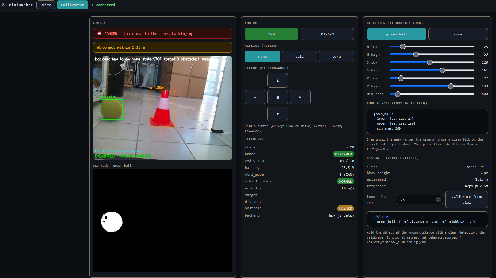
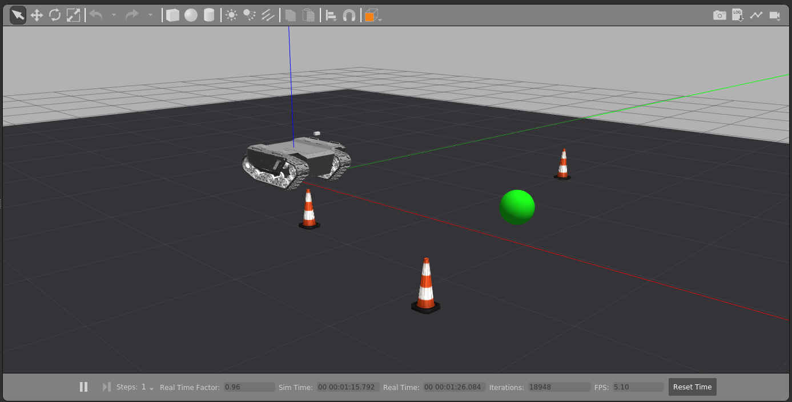
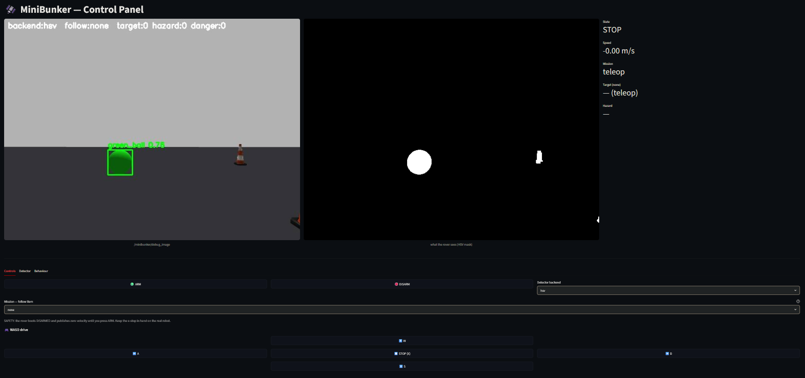

# AgileX MiniBunker 2.0 Workshop

A Space Summer School station: an AgileX **Bunker Mini 2.0** tracked rover that uses a
**Raspberry Pi 5 + Pi Camera** and **colour (HSV) vision** to recognise a **green ball**
(the "ore sample" to collect) and **construction cones** (hazards), estimates **distance
from pixels**, and drives a reactive *space-mining* behaviour. The real robot runs a
**native, no-ROS Python stack** with a **browser control panel**; the same detection +
behaviour logic also runs in **Gazebo simulation**. Fully **YAML-configurable**.

> **Status: real robot driving on the native Pi path.**
> The Bunker Mini finds and follows the green ball under **HSV** vision, reads
> **distance** from bounding-box size, completes the mission (ball → *retrieved*,
> cone → *danger* + back-off) and disarms — all from a **Flask control panel** on the
> Pi, no ROS / no Docker (camera → HSV → distance → FSM → CAN). See
> **[real_pi/](real_pi/)** + **[docs/REAL_PI_NATIVE.md](docs/REAL_PI_NATIVE.md)**. The
> Gazebo sim + Streamlit UI remain for the shared logic. A learned-vision (CNN)
> backend is scaffolded but **out of scope** for the current workshop. Design
> rationale: **[plan.md](plan.md)**.

## Gallery

**Real MiniBunker — the native control panel** (running on the real Bunker Mini, no ROS):

[](assets/mb_real_ui.mp4)

▶ [Watch video](assets/mb_real_ui.mp4) · live camera + HSV mask, distance calibration, mission + WASD on the real rover (see [docs/REAL_PI_NATIVE.md](docs/REAL_PI_NATIVE.md))

| Gazebo simulation | Streamlit control panel |
| --- | --- |
|  |  |
| ▶ [Watch video](assets/minibunker_sim_gz.mp4) · rover, cones and the ore ball in the Gazebo arena | ▶ [Watch video](assets/minibunker_sim_ui.mp4) · live camera, telemetry, ARM/DISARM, mission + WASD knobs |

## What it is

- **Same detection + behaviour, sim and real** — the HSV detector + reactive FSM run
  in the Gazebo sim and, lifted ROS-free, on the real Pi ([real_pi/](real_pi/)); only
  the camera source and the drive sink swap.
- **Colour (HSV) vision** — hand-tuned hue/saturation/value thresholds turn pixels into
  the green ball + orange cone, **calibrated live in the browser** (mask + sliders). A
  YOLOv8-nano **CNN** backend is scaffolded for the future; **not used** in the workshop.
- **Distance from pixels** — one-point calibration turns bounding-box size into metres,
  so the rover acts on **real distances** (no depth sensor).
- **Reactive state machine** — `SEARCH → APPROACH → AVOID`, then per-mission completion:
  **ball → retrieved + DISARM**, **cone → danger + back-off + DISARM**. Boots **DISARMED**.
- **Browser control panel (real)** — native **Flask** panel: live camera + HSV mask,
  Calibration tab, mission, WASD teleop, ARM/DISARM. The sim uses a **Streamlit** panel
  over rosbridge ([app.py](catkin_ws/src/minibunker_ui/app.py)).
- **One config** — [real_pi/config.yaml](real_pi/config.yaml) (real) /
  [minibunker.yaml](catkin_ws/src/minibunker_bringup/config/minibunker.yaml) (sim).

## Quick start

**Real robot (the workshop path)** — on the Raspberry Pi, with the Bunker on and the
**RC transmitter off** (it overrides CAN), e-stop in hand:

```bash
cd ~/minibunker-workshop/real_pi
mb                       # bring CAN up (gs_usb) + launch the control panel
# then open http://raspberrypi2.local:8080 in a laptop browser
```
Full setup, calibration and safety → **[docs/REAL_PI_NATIVE.md](docs/REAL_PI_NATIVE.md)**.

**Gazebo sim** — on Windows, run from **PowerShell** (the `.sh` scripts are invoked
through Git's bundled bash by full path; from a Git Bash prompt drop the prefix and use
`bash ./start_sim.sh`):

```powershell
git clone --recurse-submodules https://github.com/billisandr/minibunker-workshop
cd minibunker-workshop
& "C:\Program Files\Git\bin\bash.exe" ./start_sim.sh                              # Gazebo sim (HSV baseline)
& "C:\Program Files\Git\bin\bash.exe" ./catkin_ws/src/minibunker_ui/run_ui.sh     # http://localhost:8501
```

Full sim walkthrough (incl. a hardware-free synthetic loop) → **[docs/QUICKSTART.md](docs/QUICKSTART.md)**.

## Repo layout

```
catkin_ws/src/
├── minibunker_perception/   detector_node (CNN+HSV), pi_camera_node, image_pub_node
├── minibunker_behavior/     behavior_node (state machine)
├── minibunker_bringup/      launch + minibunker world + camera xacro + master YAML
├── minibunker_ui/           Streamlit app + rosbridge launch
├── ugv_gazebo_sim/          (submodule) Bunker / Bunker-Mini Gazebo description
├── bunker_ros/              (submodule) real driver: bunker_base/bringup/msgs
└── ugv_sdk/                 (submodule) C++ CAN layer
real_pi/                     native (no-Docker/ROS) Pi station — see docs/REAL_PI_NATIVE.md
docker/   start_sim.sh   start_real.sh   training/   docs/
```

## Built on

- [`agilexrobotics/ugv_gazebo_sim`](https://github.com/agilexrobotics/ugv_gazebo_sim) — Gazebo models (Bunker + Bunker-Mini)
- [`agilexrobotics/bunker_ros`](https://github.com/agilexrobotics/bunker_ros) — ROS1 driver for the real Bunker Mini
- [`agilexrobotics/ugv_sdk`](https://github.com/agilexrobotics/ugv_sdk) — C++ CAN layer

## Docs

- [docs/REAL_PI_NATIVE.md](docs/REAL_PI_NATIVE.md) — **the real workshop path**: native
  (no-Docker, no-ROS) Pi stack — setup, CAN protocol, HSV + distance calibration, the
  control panel, mission behaviour, full test walkthrough + real-Bunker results
- [real_pi/README.md](real_pi/README.md) — `real_pi/` quick start + file map
- [docs/QUICKSTART.md](docs/QUICKSTART.md) — run the **sim** / hardware-free / Streamlit UI
- [docs/HARDWARE_SETUP.md](docs/HARDWARE_SETUP.md) — Pi 5 + camera + CAN (Docker/ROS path)
- [docs/ARENA.md](docs/ARENA.md) — physical arena + object spec
- [docs/TRAINING.md](docs/TRAINING.md) — CNN training (Roboflow → YOLOv8n) — **deferred / out of current scope**
- [plan.md](plan.md) — full design + phased roadmap + open decisions (§15)

## Status

**Done**
- ✅ **Sim** validated — detector → behaviour → Gazebo + the Streamlit UI.
- ✅ **Real robot on the Pi** ([docs/REAL_PI_NATIVE.md](docs/REAL_PI_NATIVE.md)) — native
  no-ROS stack **driving under CAN**: HSV calibration + live mask, **pixel distance**,
  **mission completion** (ball *retrieved* / cone *danger* → DISARM), teleop proximity
  warning, and the **Flask control panel** (Drive + Calibration tabs, WASD).
- ✅ **Participant handout + instructor cards** ([../ExerciseHandouts/MiniB2_rover/](../ExerciseHandouts/MiniB2_rover/), v2).

**Remaining / optional**
- Tune **HSV + distance** under the actual arena lighting (done live in the panel).
- Operating procedure: **RC transmitter OFF** (it overrides CAN → EXCEPTION), and the
  **gs_usb CAN bring-up** each session (`real_pi/can_up.sh`). Run with the e-stop in hand.
- Optional: a `systemd` **autostart** for `run.py`; **Git LFS** for the demo videos.
- Future (out of current scope): train the **CNN** backend ([docs/TRAINING.md](docs/TRAINING.md))
  for lighting-robust detection.

---

*Space Summer School · Technical University of Crete · SenseLAB*
